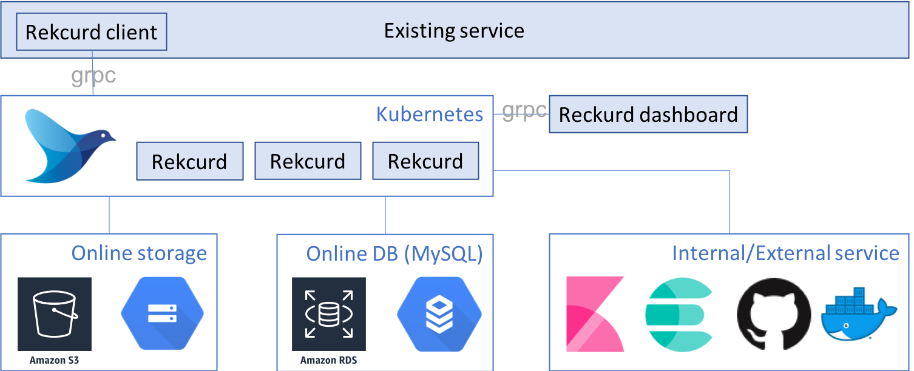

# Rekcurd-Parent

Rekcurdは機械学習モジュールの運用のためのソフトウェア群です。「機械学習モジュールの配信を簡単に」「機械学習モデルの管理と機械学習モジュールのデプロイを簡単に」「機械学習モジュールの組み込みを簡単に」というコンセプトで設計しています。RekcurdはKubernetesをサポートしています。

## Features
- High Availability
- 管理コストの低減
  - 機械学習モデルのアップロード
  - 機械学習モデルのバージョニング
  - 機械学習モデルの性能評価と可視化 (TBD)
  - 機械学習モデルの切り替え
  - 機械学習モジュールの不停止更新 *
- 監視コストの低減
  - 死活監視とオートヒーリング *
  - Load balancingとオートスケーリング *
- その他
  - WebUIあり
  - サービスレベル (development/staging/production) ごとの分離と管理 *
  - ABテスト/Canary release (TBD)
  - ログフォワーディング *
  - 既存のシステムへの組み込みが簡単

*Kubernetes利用

## Components
- [Rekcurd](https://github.com/rekcurd/drucker): 機械学習モジュールの配信のためのプロジェクトです。gRPCのマイクロフレームワークで、[Flask](http://flask.pocoo.org/)のように使えます。
- [Rekcurd-dashboard](https://github.com/rekcurd/drucker-dashboard): 機械学習モデルの管理と機械学習モジュールのデプロイのためのプロジェクトです。あらゆるRekcurdサービスを扱うことができます。またKubernetesと接続してサービスのデプロイ等ができます。
- [Rekcurd-client](https://github.com/rekcurd/drucker-client): 機械学習モジュールの組み込みのためのプロジェクトです。あらゆるRekcurdサービスと接続できます。またKubernetes上のRekcurdと接続することもできます。

### Sub components
- [dockerfiles](https://github.com/rekcurd/dockerfiles): Rekcurdのためのベースイメージです。[Docker Hub](https://hub.docker.com/r/rekcurd/rekcurd)と連携しているので、`docker pull`でイメージを使うことも出来ます。
- [drucker-grpc-proto](https://github.com/rekcurd/drucker-grpc-proto): Rekcurdが使うgRPC specです。
- [Drucker-example](https://github.com/rekcurd/drucker-example): Rekcurdのサンプルです。サンプルではscikit-learnのLinear SVCをRekcurdサービスにしています。

## Environment

### Minimum environment
- Python 3.6

### Recommended environment for production
- Python 3.6
- Kubernetes 1.9~
- MySQL 5.7
- Online storage (e.g. AWS S3, GCS, WebDAV, ...)
- DNS
- (If necessary) Private Docker registry
- (If necessary) Private git repository (e.g. GitHub Enterprise, GitLab, ...)

## Installation
See [docs](./docs/).

## Roadmap
### ~v0.2
Initial release. This version is a Minimal Viable Software.

### v0.4
Pipnize.

### v1.0
- Access control
- User authentication
- ML model evaluation and visualization
- Rancher/GCP/AWS installation support
- Unittest and Travis support

### v2.0
- C++/Java support
- Istio support
- Traffic tracing
- AB test/Canary release
- Access control (Access token)
- ML evaluation model management and versioning
- GPU support
- Kubeflow support
- Airflow support
- GitOps support

### v3.0
- Security

### vX.Y
- Open platform (e.g. marketplace)

## Support
Give us **Star**, **Issues** and **Pull requests**!

- [Twitter](https://twitter.com/rekcurd)
- [Facebook](https://www.facebook.com/rekcurd/)
- [Slack](https://rekcurd.slack.com/)
  - Join [rekcurd.slack.com](https://join.slack.com/t/rekcurd/shared_invite/enQtNTA4NDU3ODAzMzgwLTVhNWYyMTUwOTQ2NGZjMzAzNzYzNTZlZDYzY2ViMjVlOWExY2EwYmRlMDhhMDE3ZmNlNGE2Nzk4NTYzZjAwOTM)
- [Google group](https://groups.google.com/forum/?hl=ja#!forum/rekcurd-dev)

## Contributors
- [keigohtr](https://github.com/keigohtr)
- [Kenji Yamauchi](https://github.com/yustoris)
- [Wen Chun Kao](https://github.com/jkw552403)
- [yoquankara](https://github.com/yoquankara)
- [Shimpei Yotsukura](https://github.com/shimpei-yotsukura)
- [sugyan](https://github.com/sugyan)
- [yuki-mt](https://github.com/yuki-mt)
