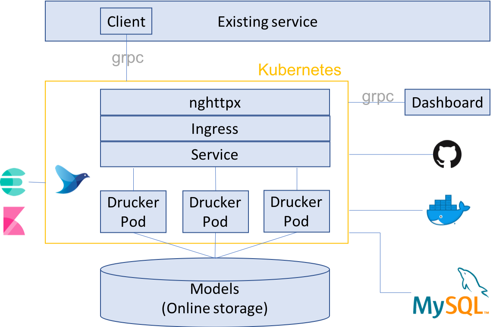

# Architectures and Roles



## Drucker
[Drucker](https://github.com/drucker/drucker) makes your ML module a gRPC microservice. Drucker is a kind of framework and is similar usage of a popular WebAPI framework such as flask and Django. Since Drucker's gRPC specification is fixed, you don't need to be familiar with gRPC itself.

[Here](https://github.com/drucker/drucker-example) is the example of integrating a ML module into Drucker template.


## Dashboard
[Drucker dashboard](https://github.com/drucker/drucker-dashboard) is a tool for Drucker gRPC microservices. Drucker dashboard manages all Drucker gRPC microservices. You can upload the latest model, switch the model and evaluate the performance of the model. If you use Drucker on Kubernetes, you can deploy your ML module to Kubernetes via Drucker dashboard.


## Client
[Drucker client](https://github.com/drucker/drucker-client) is a client for accessing Drucker gRPC microservices. [This repository](https://github.com/drucker/drucker-client) is the client for python, however, you can generate the client in any programming language by compiling the [Drucker's gRPC proto](https://github.com/drucker/drucker-grpc-proto).


## Kubernetes
[Kubernetes](https://github.com/kubernetes/kubernetes) is a well known framework for container orchestration. The benefis are rolling update, auto healing, auto scaling and so on.

We confirmed the Kubernetes cluster built by [Rancher](https://rancher.com/) but you may be able to use Drucker on the existing Kubernetes cluster such as GKE and Amazon EKS.

Drucker can manage the service level (e.g. development/beta/staging/sandbox/production) by using Kubernetes `namespace`, `node selector` and `affinity`. We keep the service level on the node server. For example, the Drucker Pods with `development` service level only run on the `development` node server. We also keep to avoid booting the same Drucker Pod in the same node server if possible.


## Load balancing
We use Kubernetes ingress and [nghttpx ingress controller](https://github.com/zlabjp/nghttpx-ingress-lb) as http2 load balancer. We assign your ML service into `host name` you reserved. All your ML services are available on `http://<app-name>-<service-level>.<domain>`. [Drucker client](https://github.com/drucker/drucker-client) supports to access your ML services easiliy.

**Note**

We will replace [nghttpx ingress controller](https://github.com/zlabjp/nghttpx-ingress-lb) to [nginx ingress controller](https://github.com/kubernetes/ingress-nginx) after it supports nginx version 1.13.10 which supports http2 protocol on 80 port.


## AB testing

AB test is available on Kubernetes. You can deploy a Drucker service with a specific configuration via [Drucker dashboard](https://github.com/drucker/drucker-dashboard).


## Logging
[fluentd-kubernetes](https://github.com/fluent/fluentd-kubernetes-daemonset) is available. fluentd-kubernetes forwards the Pod's output which are printed on `stdout` and `stderr` to the servers (e.g. kibana with ElasticSearch) you specify.


## Docker registry x Git repository
In Drucker on Kubernetes, it pulls your Drucker service from a git repository and runs it on a Docker image. You can use your own Docker image for your service. You can also use our basic Docker image [here](https://hub.docker.com/r/druckerorg/drucker/). We recommend to create your own docker image and push it to official/private docker registry for an initialization time reduction.

```
docker pull druckerorg/drucker:python-latest
```

## Online storage
We save ML models in an online storage such as AWS EBS, GCS and WebDAV. You must mount an online storage to all node servers. All Drucker Pods mount an online storage through the node server.


## MySQL
MySQL stores the model assignment of the Drucker Pods. Drucker Pod refers to MySQL to know ML model to load when it boots. This architecture is useful for switching ML model since we can use Kubernetes function of rolling update.
