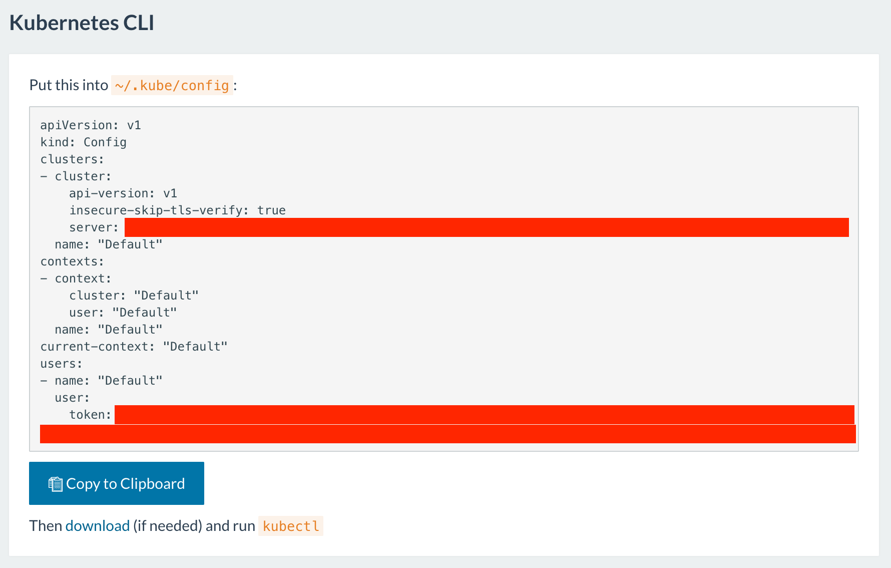
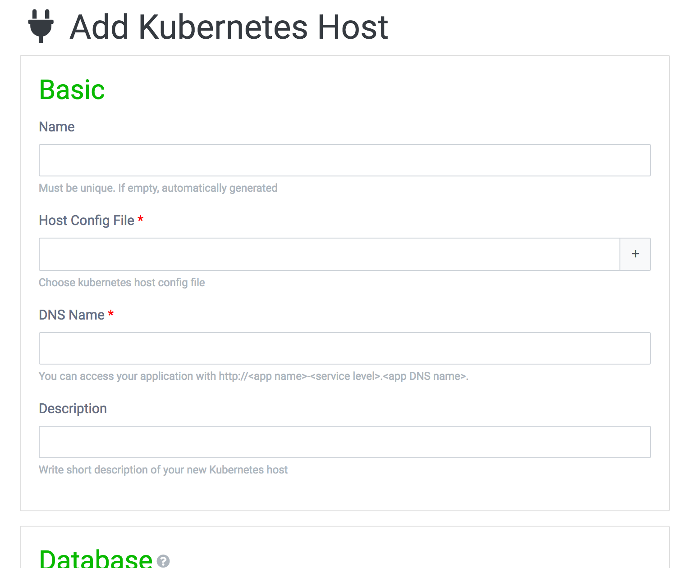
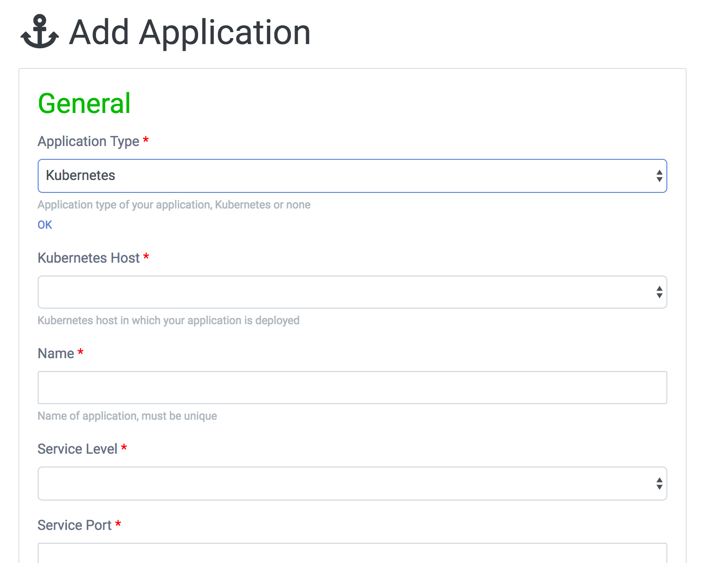
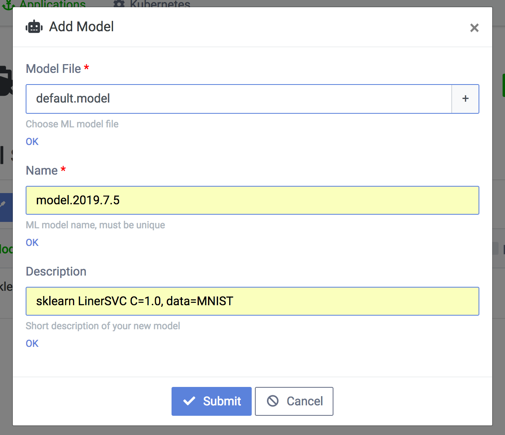
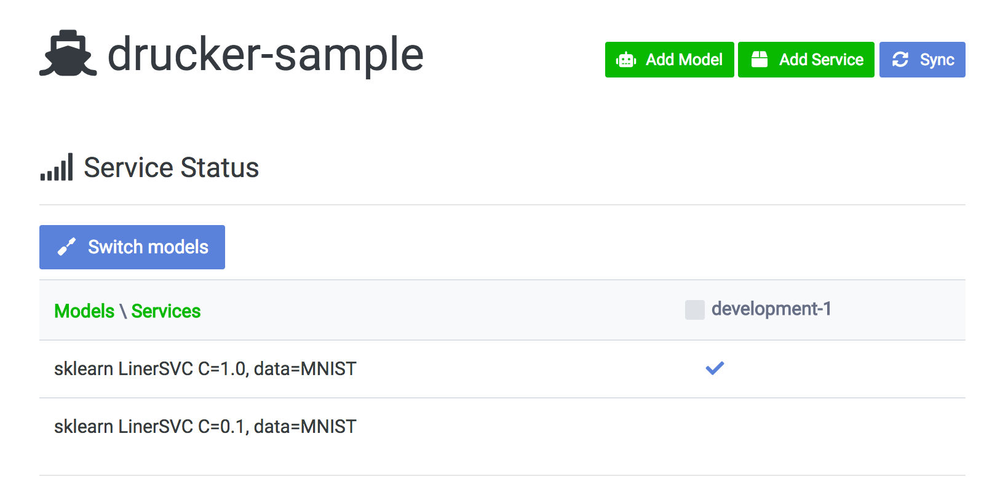
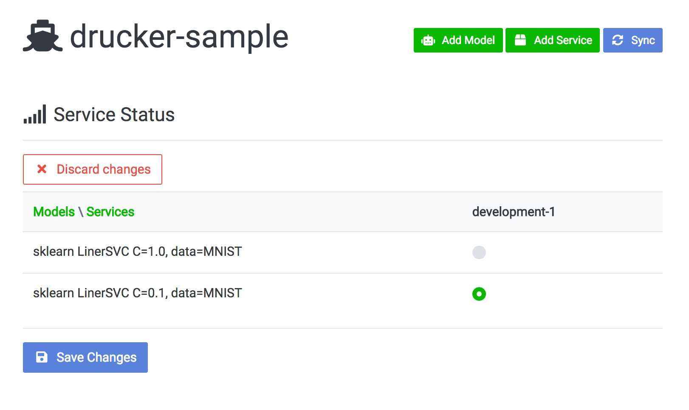

# Installation
Table of Contents.

1. [Drucker](https://github.com/drucker/drucker)
1. [Drucker-dashboard](https://github.com/drucker/drucker-dashboard)
1. [Drucker-client](https://github.com/drucker/drucker-client)
1. [Setup Rancher for Kubernetes](#setup-rancher-for-kubernetes)
1. [Create docker image](#create-docker-image)
1. [gRPC Load Balancing on Rancher](#grpc-load-balancing-on-rancher)
1. [Setup fluentd](#setup-fluentd)
1. [Deploy Drucker service to Kubernetes](#deploy-drucker-service-to-kubernetes)
1. [Access Drucker service on Kubernetes](#access-drucker-service-on-kubernetes)
1. [Upload model](#upload-model)
1. [Switch model](#switch-model)
1. [Edit service configurations](#edit-service-configurations)
1. [AB test](#ab-test)

---

## Drucker
https://github.com/drucker/drucker

---

## Drucker-dashboard
https://github.com/drucker/drucker-dashboard

---

## Drucker-client
https://github.com/drucker/drucker-client

---

## Setup Rancher for Kubernetes
If you already use Kubernetes such as GKE (Google Kubernetes Engine) or Amazon EKS (Amazon Elastic Container Service for Kubernetes) or minikube, skip here. We introduce you [Rancher](https://rancher.com/) as known as a container management system. You can refer the official installation guide [here](https://rancher.com/docs/rancher/v1.6/en/installing-rancher/installing-server/).

### Environments
- CentOS 7.4
- Rancher 1.6.16
- Docker 17.03
- MySQL 5.7

### HA configurations
#### Rancher server
- HA nodes (a minimum of 3 nodes is required):
  - CentOS 7
  - 8GB RAM instance
- MySQL 5.7
- DNS

##### MySQL
```
CREATE DATABASE /*!32312 IF NOT EXISTS*/ `cattle` /*!40100 DEFAULT CHARACTER SET utf8 */;
```

You must have a DDL privilege for the node servers.

##### HA node setting
Specify <mysql-host>, <port>, <user>, <password> and <IP_of_the_Node>. <IP_of_the_Node> below is the IP address which runs on.

```
sudo yum-config-manager --add-repo https://download.docker.com/linux/centos/docker-ce.repo
sudo yum -y makecache fast
sudo yum -y install yum-versionlock
echo 'docker-ce-17.03.2.ce-1.el7.centos.x86_64' | sudo tee -a /etc/yum/pluginconf.d/versionlock.list
sudo yum -y install docker-ce-17.03.2.ce-1.el7.centos.x86_64
sudo systemctl start docker
sudo systemctl enable docker
sudo docker run -d --restart=unless-stopped -p 8080:8080 -p 9345:9345 rancher/server:v1.6.16 --db-host <mysql-host> --db-port <port> --db-user <user> --db-pass <password> --db-name cattle --advertise-address <IP_of_the_Node>
```

After 60 seconds, Rancher dashboard is available on `http://localhost:8080/`

##### Setup Rancher
###### DNS
Create a VIP or load balancer for node servers and assign DNS to it. Then go to "Admin" -> "Settings" on Rancher dashboard and set DNS to "Host Registration URL".

###### Activate Kubernetes
Go to "Add from Catalog" and activate Kubernetes with a configuration of "Enable Rancher Ingress Controller = False".

###### Confirmation
Go to "Admin" -> "High Availability" and confirm the status of HA clusters.


#### Rancher agent
- Client nodes
  - CentOS 7
  - 8GB RAM instance

##### Client node setting
```
sudo yum-config-manager --add-repo https://download.docker.com/linux/centos/docker-ce.repo
sudo yum -y makecache fast
sudo yum -y install yum-versionlock
echo 'docker-ce-17.03.2.ce-1.el7.centos.x86_64' | sudo tee -a /etc/yum/pluginconf.d/versionlock.list
sudo yum -y install docker-ce-17.03.2.ce-1.el7.centos.x86_64
sudo systemctl start docker
sudo systemctl enable docker
```

##### Add node to a cluster
1. Go to "Infrastracture" -> "Host" -> "Add Host" -> "Custom" on Rancher dashboard.
1. Click "Add Label" and set to "key=host" and "value=development". If you want to add a node for "staging", set "value" to "staging".
1. Copy the script on the above page and run it on client nodes.

##### DNS
Every client nodes can be the endpoint of Kubernetes ingress. Create a VIP or load balancer for client nodes and assign DNS to it. Then your Drucker service can be accessed at `http://<app.name>-<app.service.level>.<your.dns>`.

##### Mount an online storage
Mount your online storage (e.g. AWS S3, EBS, GCS, WebDAV) on the nodes. As a default configuration, we use `/mnt/drucker-model` as a mounted online volume and mount node's `/mnt/drucker-model` to pod's `/mnt/drucker-model`.

##### (OPTION) Add git ssh
Add your git ssh to `/root/.ssh/` on the nodes if you use your private git repository. When you boot your Drucker service via Drucker dashboard, we mount node's `/root/.ssh` to pod's `/root/.ssh`.

---

## Create docker image
Since Kubernetes requires Docker, you must use a docker registry. Official docker registry is available but you can also use your private docker registry.

Our sample Dockerfile is available [here](https://github.com/drucker/dockerfiles).

---

## gRPC Load Balancing on Rancher
We use [nghttpx Ingress Controller](https://github.com/zlabjp/nghttpx-ingress-lb) as gRPC load balancer. However we will replace it to [nginx ingress controller](https://github.com/kubernetes/ingress-nginx) after it supports nginx version 1.13.10 which supports http2 protocol on 80 port.

#### Disable Rancher Ingress Controller
On Rancher dashboard

1. Select "Manage Environments"
1. Select "Kubernetes → Edit"
1. Select "Edit Config"
1. Set "Enable Rancher Ingress Controller" to "False"

#### Boot nghttpx Ingress Controller
1. "git clone" [nghttpx Ingress Controller](https://github.com/zlabjp/nghttpx-ingress-lb).
1. Go to "Kubernetes Dashboard" via Rancher. Set "namespace" to "kube-system".
1. Run below files
    1. ./examples/default-backend.yaml
    1. ./examples/default-backend-svc.yaml
    1. ./examples/default/service-account.yaml
    1. ./examples/daemonset/as-daemonset.yaml

---

## Setup fluentd
[fluentd](https://github.com/fluent/fluentd-kubernetes-daemonset) is officially available on Kubernetes. You can forward the log messages to the server you specify just printing it to stdout/stderr.

---

## Deploy Drucker service to Kubernetes
You can deploy your Docker service via drucker dashboard.

Download or save a Kubernetes access token. If you use "Rancher", access "Kubernetes CLI" and click "Generate Config". After that click "Copy to Clipboard" and save it to the file.



Access to Drucker dashboard and click "Kubernetes" on a head menu. You can add your Kubernetes cluster by "Add Host". `Name` is display name for this dashboard. `Host Config File` must be set your Kubernetes access token file. `DNS Name` is your reserved DNS name. `Database` is MySQL configurations which stores model assignment of your Drucker service. `Model Storage` is the place your model store. `/mnt/drucker-model` is the default place as a mounted online volume.



On the top page (e.g. `http://localhost/application`), click "Add Application" and choose `Kubernetes` from "Application Type". Specify the configurations.



---

## Access Drucker service on Kubernetes
You can access your Drucker service.

Your Drucker service can be accessed at `http://<app.name>-<app.service.level>.<your.dns>`.

---

## Upload model
You can upload your latest ML model via Drucker dashboard.

Access to Drucker dashboard and open your application page (e.g. `http://localhost/applications/1/deploy`). "Add Model" is that you can upload your latest ML model to your Drucker service. "Model File" must be set your ML model. "Name" is a display name of this dashboard.



---

## Switch model
You can swith a ML model on your Drucker service via Drucker dashboard.

Access to Drucker dashboard and open your application page (e.g. `http://localhost/applications/1/deploy`). "Switch Models" is that you can switch the model of your Drucker service. After Switching model, your Drucker service is automatically rolling updated by Kubernetes.

**Default**



**Switch mode**



---

## Edit service configurations
You can edit your existing Kubernetes services via Drucker dashboard.

Access to Drucker dashboard and open your application page (e.g. `http://localhost/applications/1/deploy`). Click the service name and you can edit the configuration (e.g. CPU request, scaling policies) of your Drucker service. If you click "Save Service", your Drucker service is automatically rolling updated by Kubernetes. If you want to do a rolling update without changing the configurations, just edit "Memo" and click "Save Service", then rolling update is executed.

---

## AB test
You can create AB test via Drucker dashboard.

Access to Drucker dashboard and open your application page (e.g. `http://localhost/applications/1/deploy`). Click "Add Service" and select an appropriate "Service Level" to run AB test. You can launch multiple services with different configurations at the same service level. Note that Drucker do not support analysis. If you want to analyze the differences of each configuration, you must print the information necessary on your Drucker service and analyze them by yourself.

---